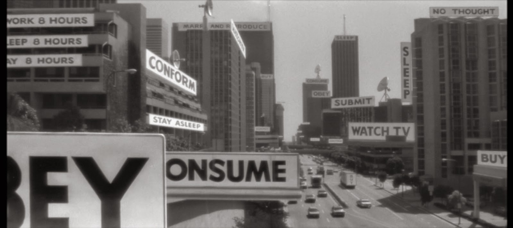

# They Live Adblocker



A fork of [uBlock Origin Lite](https://github.com/uBlockOrigin/uBOL-home) that, instead of *hiding* cosmetically-blocked ads, **replaces** them with white tiles bearing slogans from John Carpenter's 1988 film *They Live*: **OBEY**, **CONSUME**, **WATCH TV**, **SLEEP**, **SUBMIT**, **CONFORM**, **STAY ASLEEP**, **BUY**, **WORK**, **NO INDEPENDENT THOUGHT**, **DO NOT QUESTION AUTHORITY**.

Each blocked ad gets a single phrase, picked at random from the list.

The idea is from a blog post I wrote in 2015 (and never got around to building): [_They Live adblock mode_](https://proceduralgraphics.blogspot.com/2015/04/they-live-adblock-mode.html).

## Install

Download the latest **`uBOLite_theylive.chromium.zip`** from the [Releases page](https://github.com/davmlaw/they_live_adblocker/releases), extract it, then in Chromium / Chrome / Brave / Edge:

1. Open `chrome://extensions`
2. Toggle **Developer mode** on (top-right)
3. Click **Load unpacked** and select the extracted folder

Keep the folder around — the extension is loaded from that path.

### Make it actually replace ads

By default uBO Lite uses **Basic** filtering mode, which blocks ads at the network layer. Network-blocked ads never produce a DOM element, so there's nothing to "they-live-ify" — you just get empty space, as with normal uBO Lite. To see the OBEY tiles:

1. Click the uBO Lite toolbar icon → cog (⚙) → Dashboard.
2. Set the filtering mode for the sites you care about to **Optimal** or **Complete**.
3. Reload.

## Building from source

Requires Node 22.

```bash
git clone --recursive https://github.com/davmlaw/they_live_adblocker
cd they_live_adblocker/uBlock
nvm use 22                       # or otherwise ensure Node >= 22
tools/make-mv3.sh chromium       # or: firefox | edge | safari
```

The packaged extension lands in `uBlock/dist/build/uBOLite.chromium/` — load it as an unpacked extension.

## How it works

uBO Lite's cosmetic filtering normally injects CSS like `selector { display: none !important }` to hide matched ad elements. This fork patches those injection sites to instead apply a white-box mask with a `::after` overlay whose `content` is read from a `data-ubol-they-live` attribute, then walks the DOM (with a MutationObserver for late-loaded ads) to tag each matched element with a random phrase from the list.

Touched files in the [`davmlaw/uBlock`](https://github.com/davmlaw/uBlock/tree/they-live) submodule:

- `platform/mv3/extension/js/scripting/they-live.js` *(new)* — phrase list, CSS generator, DOM tagging
- `platform/mv3/extension/js/scripting/css-{specific,generic,procedural-api}.js` — call sites
- `platform/mv3/extension/js/scripting-manager.js` — registers `they-live.js` ahead of consumers

## Caveats

- Personal hobby fork; **not** an official uBlock Origin product. Don't file uBO issues against this.
- Forcing previously-hidden elements visible can occasionally shift page layout where the site's CSS assumed the ad slot collapsed.
- Custom user-defined cosmetic filters still hide normally (no OBEY treatment).
- Network-blocked ads (most of uBO Lite's blocking) don't get replaced — only cosmetic-filtered ones do.

## License

GPL-3.0, same as upstream uBlock Origin / uBO Lite.
